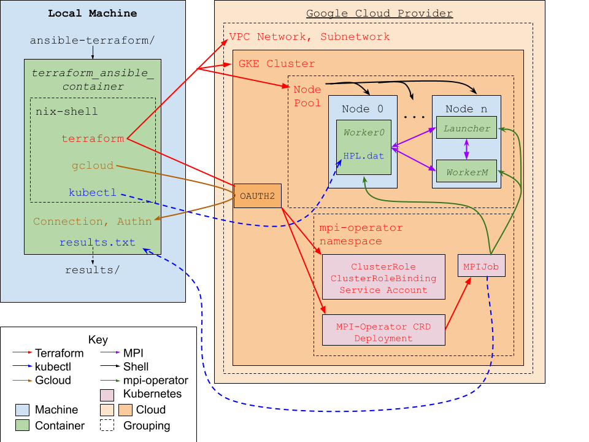

Deploying MPI Clusters with Terraform/Ansible
---------------------------------------------
One way of running mpi jobs is "manually" with Terraform and Ansible. Here's a broad overview of how we do it in the [ansible-terraform repo](https://github.com/federatedcloud/ansible-terraform). Instructions for how to use that tool are given in their fullest detail in the [benchmarks](https://github.com/federatedcloud/ansible-terraform/benchmarks)

1. A docker container builds a nix environment that installs Terraform and Ansible
2. The container uses Terraform to create a public cloud network, a base instance, and all the protocols needed to manage traffic.
3. The base instance downloads all the tools necessary to run the your mpi application and creates the image it will run from via Ansible.
4. Terraform goes through a few steps enabling it to make duplicates of that base instance, then creates those duplicates with the networking information needed to run mpi jobs.
5. Terraform then has Ansible run the multivm mpi job.
6. Getting the results has not yet been automated. One option is detailed below for GCP:
  - Go to the Cloud Console > Compute Engine > VM instances > mpi-instance0.
  - Click ssh to connect to open a terminal connected to the vm in your brower.
  - You can now use `docker cp` and `scp` to transfer the files back to your machine.

MPI Clusters with Terraform/Kubernetes
--------------------------------------
Alternatively, we can use a Terraform/Kubernetes deployment. Currently, this relies on cutting edge tools including terraform 0.13 RC-1 (binary provided), google-beta provider, kubernetes-alpha provider (binary provided, available [here](https://github.com/hashicorp/terraform-provider-kubernetes-alpha/releases/tag/v0.1.0)) as well as mpi-operator, a tool currently in development as part of Kubeflow.

In order to use this tool, you'll need to set a few configuration options and provide the necessary credentials first. Everything you need to do is detailed below
- Create a google service account and place the credentials in [tf-kubernetes](tf-kubernetes).
- Give the service account permissions to use cluster role bindings (Kubernetes Admin is sufficient, container.clusterRoleBindings.\* roles are necessary.
- Set each variable in [terraform.tfvars](tf-kubernetes/terraform.tfvars). Refer to [variables.tf](tf-kubernetes/variables.tf) for the complete list and descriptions.
- Customize [HPL.dat](tf-kubernetes/HPL.dat).
- Update [hpl-benchmarks.tf](tf-kubernetes/staging/hpl-benchmarks.tf) accordingly.

Running `build.sh` causes the following to happen:
1. A Docker image is created, copying everything necessary to run terraform and installing kubectl and gcloud.
2. A container is created from the image, which will run [run.sh](nix/run.sh)
3. Terraform provisions a GCP VPC network and subnetwork for the cluster to operate on
4. Terraform creates a cluster and non-default node pool running kubernetes 1.17+ (required for alpha kubernetes provider)
5. gcloud connects kubernetes to the cluster, which in turn allows terraform to deploy resources to it.
6. Due to required server-side planning with the alpha kubernetes provider, [namespace.tf](tf-kubernetes/staging/namespace.tf) is copied to the work directory and the `mpi-operator` namespace is created.
7. [mpi-operator.tf](tf-kubernetes/staging/mpi-operator.tf), the file describing the service account, cluster role, and cluster role binding is copied to the work directory and the corresponding resources are created.
8. Next, the `mpijob` custom resource and the `mpi-operator` deployment are brought into the work directory via [mpijob_crd.tf](tf-kubernetes/staging/mpijob_crd.tf) and created.
8. The [hpl-benchmarks.tf](tf-kubernetes/staging/hpl-benchmarks.tf) file contains the MPIJob, which is the last resource added.
9. The container sleeps for two minutes to allow the nodes to build, and then copies [HPL.dat](tf-kubernetes/HPL.dat) to the head worker node, which is sleeping to wait for the file.
10. mpi-operator executes the runscript given in [hpl-benchmarks.tf](tf-kubernetes/staging/hpl-benchmarks.tf), and the results are automatically placed in the logs of the launcher node.
11. Those logs are copied to the container, and then locally to hpl-results.txt

This process is depicted in the following diagram

Furthermore, there is an example Asciicast of using this application available [locally](terraform-kubernetes.cast) as well as [online](https://asciinema.org/a/oQotgjY7fOL77xKGSLDZZP7Yc) (Consider adding `?speed=<speed increase factor>` to the URL).
