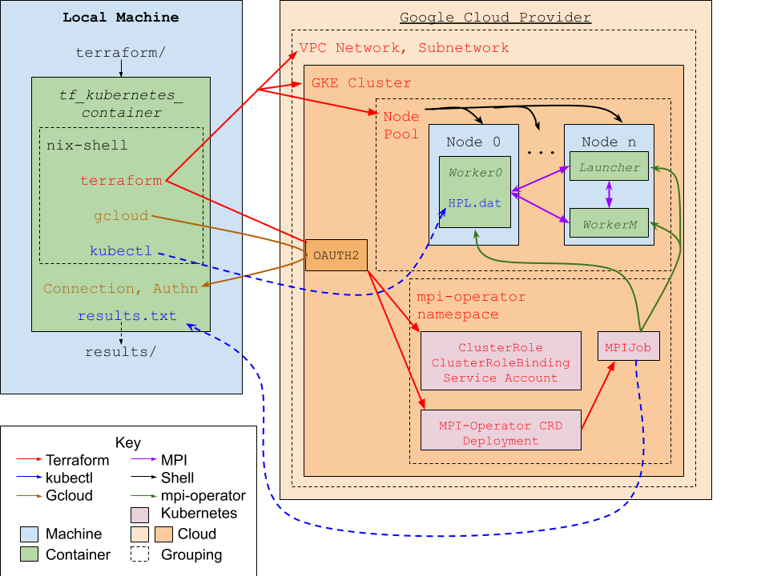

MPI Clusters with Terraform/Kubernetes
--------------------------------------
As Terraform has matured, it has become possible to automate the construction and use of an MPI capable cluster with Kubernetes. A nix-based docker container is run locally that installs `terraform`, `kubectl`, and the google cloud CLI `gcloud`. From this container, `terraform` creates a kubernetes cluster, `gcloud` connects kubernetes and terraform to the cluster, and the kubernetes resources from `mpi-operator` are created, once again using `terraform`. 
MPI-operator allows us to create a custom reasource called an `MPIJob`. When an MPIJob is created, the mpi-operator deployment will create an associated Launcher pod and a specified number of Worker pods. These pods all start a docker container specified in the [MPIJob file](tf-kubernetes/staging/mpijob.tf), and then the Launcher runs a provided command on one of the workers to run the application. Anything printed to `stdout` or `stderr` goes to into the Launcher's logs, which can be accessed via `kubectl logs` on the local container.
To use MPI-operator, we employ the [Kubernetes provider for Terraform (alpha)](https://github.com/hashicorp/terraform-provider-kubernetes-alpha). The other providers are `google`, `google-beta`, and `kubernetes`. Their minimum versions and specifications are in [providers.tf](tf-kubernetes/providers.tf).

Many of the configuration options are accessible through [variables.tf](tf-kubernetes/variables.tf), but it's recommended that you inspect each `.tf` file to make sure the specifications match your needs.

In order to use this tool, you'll need to set a few configuration options in [terraform.tfvars](tf-kubernetes/terraform.tfvars) and provide the necessary credentials first. Everything you need to do is detailed below.
- Create or connect to a Google Cloud Project. Set the `project_id` and `owner` fields accordingly (see [creating a GCP project](https://developers.google.com/workspace/marketplace/create-gcp-project)).
- Create a google service account and download the credentials (see [the guide](https://cloud.google.com/iam/docs/creating-managing-service-account-keys#iam-service-account-keys-create-console). Then, place the credentials somewhere in [tf-kubernetes](tf-kubernetes) and edit the `google_credentials` variable.
  - Alternatively, edit the [Dockerfile](Dockerfile) to copy in the credentials file from elsewhere, and have the `google_credentials` variable point to where it will exist in the container.
- Give the service account permissions to use cluster role bindings. Giving that service account the 'Kubernetes Admin' title is the easiest way to do this, but specifically, you need the container.clusterRoleBindings.\* roles). See [changing access to resources](https://cloud.google.com/iam/docs/granting-changing-revoking-access).
- Set the remaining variables in [terraform.tfvars](tf-kubernetes/terraform.tfvars). Refer to [variables.tf](tf-kubernetes/variables.tf) for the complete list and descriptions. Additionally, [mpijob.tf](tf-kubernetes/staging/mpijob.tf) will likely require additional configuration.
- Configure any specific interactions between terraform-kubernetes and your container. In our case, we modify [HPL.dat](tf-kubernetes/HPL.dat) and add a `ConfigMap` in [mpi-operator.tf](staging/mpi-operator.tf).

Running [build.sh](nix/build.sh) via `source build.sh <RUN NAME>` automates the following steps. Feel free to run the commands individually or change the script to suit your needs.
1. A Docker image is created, setting up the working environment by installing terraform, kubectl, and gcloud.
2. A container is created from the image, which will run [run.sh](nix/run.sh), which executes the remaining steps.
3. Terraform provisions a GCP VPC network and subnetwork for the cluster to operate on, then a cluster and non-default node pool running kubernetes 1.17+ (required for kubernetes-alpha provider).
4. `gcloud` connects kubernetes to the cluster, which in turn allows terraform to deploy resources to it.
5. [mpi-operator.tf](tf-kubernetes/staging/mpi-operator.tf), the file describing the namespace, service account, cluster role, cluster role binding, deployment, and mpijob custom resource definition needed to use mpi-operator, is copied to the work directory and the corresponding resources are created. This file is also a good place to add any other kubernetes resources.
6. The [mpijob.tf](tf-kubernetes/staging/mpijb.tf) file contains the MPIJob, which is the last resource added. In a future version of the `kubernetes-alpha` provider, it may be possible to combine this with the previous step.
7. MPI-operator creates a launcher pod, then the specified number of worker pods, which run the provided containers.
8. MPI-operator executes the runscript given in as a variable in [terraform.tfvars](tf-kubernetes/terraform.tfvars) on the `worker-0` pod, and the results are automatically placed in the logs of the launcher node.
9. Those logs are copied to the local container, and then out of the container to `results/<RUN NAME>.txt`

This process is depicted in the following diagram


Furthermore, there is an example Asciicast of using this application available [locally](terraform-kubernetes.cast) as well as [online](https://asciinema.org/a/oQotgjY7fOL77xKGSLDZZP7Yc) (Consider adding `?speed=<speed increase factor>` to the URL). (Note: this may be outdated).

Finally, this tool supports making changes and rerunning the mpi-job via [rerun.sh](nix/rerun.sh). However, some operations (e.g., changing the type of VM or from a regional to zonal cluster (or vice versa), effectively destroy the cluster which can cause issues with kubernetes resources. To avoid issues, run
```bash
source destroy.sh
<Edit files>
source build.sh <run name>
```

Deploying MPI Clusters with Terraform/Ansible
---------------------------------------------
An alternative way of running mpi jobs is "manually" with Terraform and Ansible. Here's a broad overview of how we do it in the [ansible-terraform repo](https://github.com/federatedcloud/ansible-terraform). Instructions for how to use that tool are given in more detail in the [benchmarks](https://github.com/federatedcloud/ansible-terraform/benchmarks) directory of that repo.

1. A docker container builds a nix environment that installs Terraform and Ansible
2. The container uses Terraform to create a public cloud network, a base instance, and all the protocols needed to manage traffic.
3. The base instance downloads all the tools necessary to run the your mpi application and creates the image it will run from via Ansible.
4. Terraform goes through a few steps enabling it to make duplicates of that base instance, then creates those duplicates with the networking information needed to run mpi jobs.
5. Terraform then has Ansible run the multivm mpi job.
6. Results are copied back to the local machine
